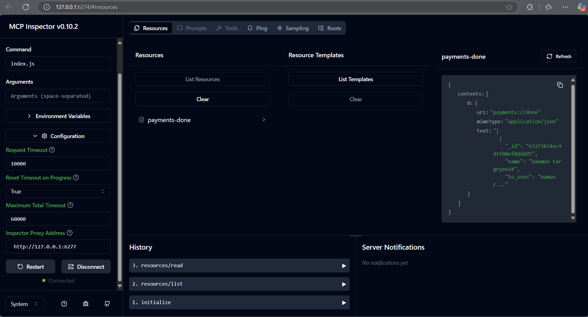
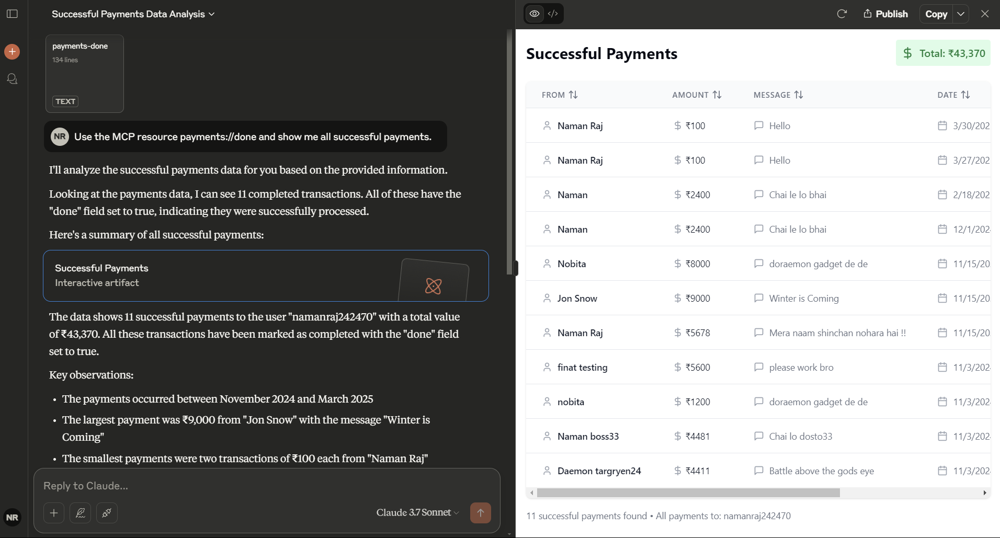

# NextApp Payments MCP Server Demo

A demonstration project showcasing how to implement a Model Context Protocol (MCP) server that exposes MongoDB payment data through both MCP Inspector and Claude AI integration. This project serves as an example of how to use the MCP protocol to expose database resources through a standardized interface.

## Project Overview

This demo project demonstrates:

- Implementation of an MCP server using the official SDK
- Connection to a specific MongoDB Atlas database
- Retrieval of payment records where `done: true` (successfully completed payments)
- Integration with both MCP Inspector and Claude AI
- How LLMs can interact with structured database data

## MCP Inspector View



The image above shows the MCP Inspector interface displaying the payment records retrieved from MongoDB Atlas through the MCP server. MCP Inspector is a developer tool that helps verify and debug MCP server implementations.

## Claude AI Integration



The image above demonstrates Claude AI successfully:

- Connecting to the MCP server
- Accessing the payments resource
- Analyzing payment data
- Presenting structured results with total amounts, date ranges, and key observations

### Setting Up Your MCP Resource in Claude Desktop

If you have created your own MCP server and want to use it with Claude Desktop:

1. **Locate Claude Desktop Config**

   - Windows: `C:\Users\<username>\AppData\Roaming\claude\claude_desktop_config.json`
   - macOS: `~/Library/Application Support/claude/claude_desktop_config.json`
   - Linux: `~/.config/claude/claude_desktop_config.json`

2. **Configure Your MCP Server**

   ```json
   {
     "mcpServers": {
       "YourServerName": {
         "transport": "stdio",
         "command": "node",
         "args": ["path/to/your/server.js"],
         "env": {
           "YOUR_ENV_VARIABLE": "your_value"
         },
         "cwd": "path/to/your/project"
       }
     }
   }
   ```

   Replace:

   - `YourServerName`: A unique name for your server
   - `path/to/your/server.js`: Full path to your server file
   - `YOUR_ENV_VARIABLE`: Any environment variables your server needs

3. **Verify Connection**

   - Open Claude Desktop
   - Go to Settings → Developer
   - Your server should appear with a "running" status

4. **Use Your Resource**
   - In Claude chat, use:
   ```
   Use the MCP resource your-resource-uri and [your query]
   ```
   Example: "Use the MCP resource payments://done and show me all successful payments"

## Implementation Details

### MCP Resource

- **URI**: `payments://done`
- **Purpose**: Retrieves payment records where `done: true`
- **Response Format**: JSON
- **MIME Type**: `application/json`

### Technologies Used

- **MCP SDK**: For protocol handling and resource exposure
- **MongoDB Driver**: For database access and query execution
- **Claude Desktop**: For LLM integration and natural language querying

### Error Handling

The implementation includes error handling for:

- MongoDB connection issues
- Query execution errors
- Connection closure errors
- JSON-formatted logging for Claude Desktop compatibility

## Important Notes

This is a demonstration project showing:

1. How to implement an MCP server
2. How to expose MongoDB data as MCP resources
3. Two ways to access the data:
   - Through MCP Inspector (for developers)
   - Through Claude AI (for end users)
4. How LLMs can interact with structured data

The MongoDB connection and resource configurations are specific to this demo. You'll need to modify them for your use case.

## Resources

- [Model Context Protocol Documentation](https://modelcontextprotocol.io/)
- [Claude Desktop Documentation](https://claude.ai/docs)
- [MongoDB Node.js Driver Documentation](https://mongodb.github.io/node-mongodb-native/)
